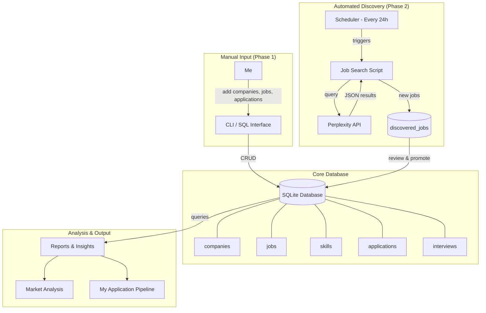
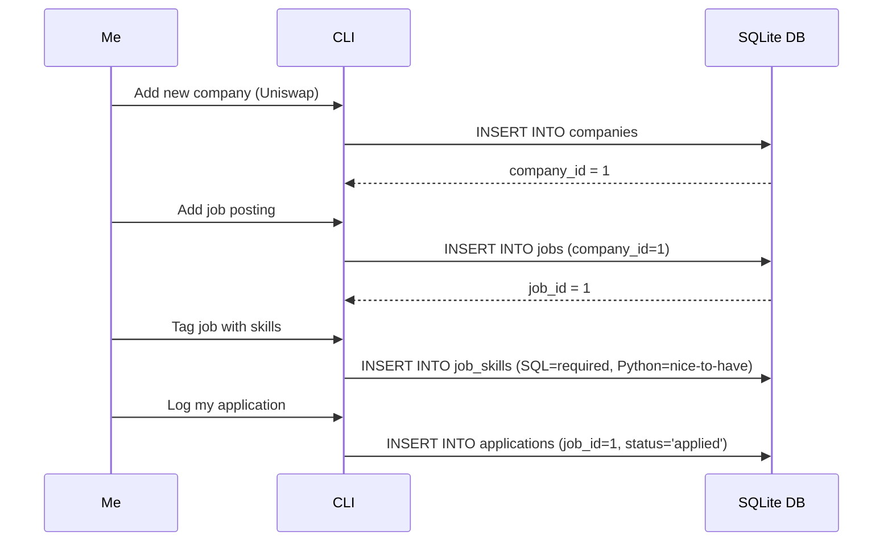
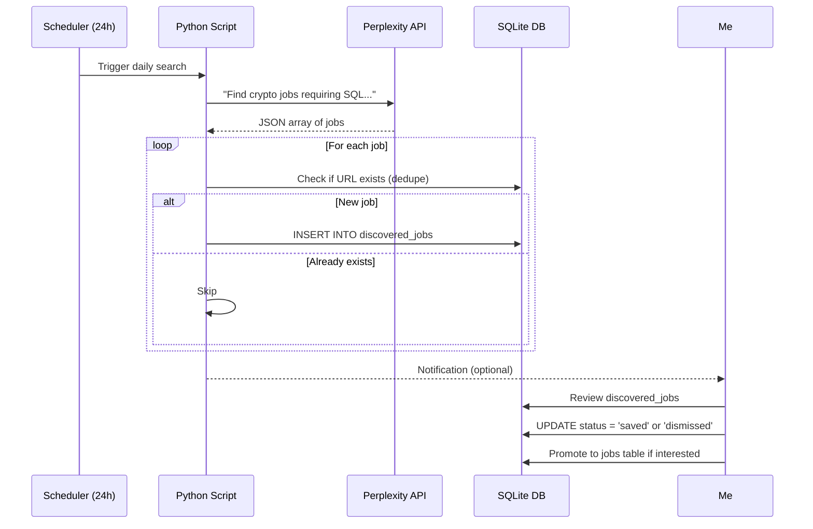
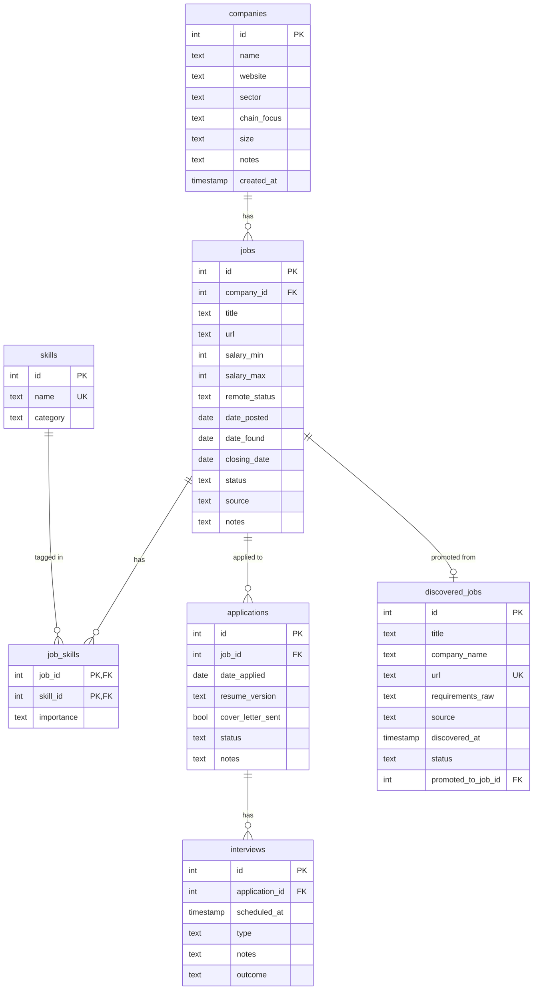

# AI Coding Agent Prompt: Crypto Jobs Database Project

## Context

I'm a junior developer learning databases. I want to build a personal database to track crypto/web3 job postings, with a focus on jobs that require or prefer SQL skills. This is both a practical tool for my job search and a portfolio project to demonstrate database design skills.

## Project Goals

1. Track crypto/web3 companies and their job postings
2. Log job requirements and skills (with special attention to SQL-related skills)
3. Track my personal applications and their status
4. Automatically discover new relevant jobs using Perplexity API
5. Run useful queries to analyze the job market and my application performance

---

## System Overview



---

## Data Flow: Manual Job Entry



---

## Data Flow: Automated Job Discovery (Phase 2)



---

## Database Schema



---

## Functional Requirements

### Phase 1: Core Database (MVP)

**Company Management**
- Add/edit/view companies
- Fields: name, website, sector (DeFi/NFT/Infrastructure/Exchange/Analytics), chain focus, size, notes

**Job Tracking**
- Add/edit/view job postings linked to companies
- Fields: title, URL, salary range, remote status, dates, status (open/closed/expired), source
- Tag jobs with skills (many-to-many)
- Mark skills as "required" vs "nice-to-have"

**Application Tracking**
- Log applications with date, resume version, cover letter flag, status, notes
- Status workflow: applied → screening → interview → rejected/offer/ghosted/withdrawn

**Interview Logging**
- Track interviews per application
- Fields: date, type (recruiter/technical/sql-challenge/culture/final), notes, outcome

### Phase 2: Automated Job Discovery

**Perplexity API Integration**
- Daily scheduled search for new crypto/web3 jobs requiring SQL
- Parse results into structured data
- Store in `discovered_jobs` staging table
- Deduplicate against existing jobs (by URL)

**Review Workflow**
- View pending discovered jobs
- Dismiss irrelevant ones
- Promote good ones to main `jobs` table (auto-create company if needed)

**Configuration**
- Customizable search query
- Adjustable schedule (default: every 24 hours)
- API key stored securely (environment variable)

---

## Key Queries to Support

```sql
-- Jobs where SQL is required (my best fits)
SELECT j.title, c.name, j.url
FROM jobs j
JOIN companies c ON j.company_id = c.id
JOIN job_skills js ON j.id = js.job_id
JOIN skills s ON js.skill_id = s.id
WHERE s.category = 'SQL' AND js.importance = 'required';

-- Most in-demand skills
SELECT s.name, COUNT(*) as demand
FROM skills s
JOIN job_skills js ON s.id = js.skill_id
GROUP BY s.name ORDER BY demand DESC;

-- My application pipeline
SELECT status, COUNT(*) FROM applications GROUP BY status;

-- Jobs I haven't applied to yet
SELECT j.title, c.name, j.date_found
FROM jobs j
JOIN companies c ON j.company_id = c.id
LEFT JOIN applications a ON j.id = a.job_id
WHERE a.id IS NULL AND j.status = 'open';

-- Pending discovered jobs to review
SELECT title, company_name, url, discovered_at
FROM discovered_jobs
WHERE status = 'pending'
ORDER BY discovered_at DESC;
```

---

## Technical Requirements

| Component | Choice | Rationale |
|-----------|--------|-----------|
| Database | SQLite | Simple, portable, no server, great for learning |
| Language | Python 3.10+ | Readable, good libraries, I want to learn it |
| Perplexity API | sonar model | Online search capability, returns current results |
| Scheduler | cron or APScheduler | Simple, reliable for daily tasks |
| Interface | CLI first, TUI later maybe | Start simple, iterate |

**Environment**
- Runs locally on my machine
- API key via environment variable `PERPLEXITY_API_KEY`
- Single SQLite file `crypto_jobs.db`

---

## Project Structure (Proposed)

```
crypto-jobs-tracker/
├── README.md
├── requirements.txt
├── .env.example
├── crypto_jobs.db          # SQLite database (gitignored)
├── src/
│   ├── __init__.py
│   ├── db/
│   │   ├── __init__.py
│   │   ├── schema.sql      # Table definitions
│   │   ├── seed.sql        # Initial skills data
│   │   └── connection.py   # DB connection helper
│   ├── cli/
│   │   ├── __init__.py
│   │   └── main.py         # CLI commands
│   ├── discovery/
│   │   ├── __init__.py
│   │   ├── perplexity.py   # API client
│   │   ├── parser.py       # Parse API response
│   │   └── scheduler.py    # Cron/scheduling logic
│   └── queries/
│       ├── __init__.py
│       └── reports.py      # Predefined useful queries
├── scripts/
│   └── run_discovery.py    # Manual trigger for job search
└── tests/
    └── ...
```

---

## Instructions for You (the AI Agent)

> **IMPORTANT: Do not write any code yet.**

### Phase 1: Discovery & Clarification

First, ask me any clarifying questions about:
- Unclear requirements
- Edge cases I might not have considered
- Trade-offs I should be aware of
- Features that might be missing or unnecessary
- My technical environment and constraints
- The Perplexity API integration specifics

Take your time. Ask as many questions as you need. I'd rather answer 10 questions now than refactor later.

### Phase 2: High-Level System Design

Once you understand the requirements, present a high-level design that includes:

1. **Architecture overview** — validate or improve the diagrams above
2. **Database schema design** — finalize tables, columns, relationships with reasoning
3. **Data flow** — confirm how data moves through the system
4. **File/folder structure** — confirm or adjust the proposed structure
5. **Technology choices** — confirm or suggest alternatives with justification
6. **Perplexity integration details** — prompt design, response parsing strategy, error handling

Present this as a proposal. Explain your reasoning. Highlight any trade-offs.

### Phase 3: Design Review

After presenting the design, **stop and wait for my feedback**. I may:
- Approve the design as-is
- Ask for changes
- Have follow-up questions
- Want to simplify or expand scope

**Do not proceed to coding until I explicitly approve the design.**

### Phase 4: Implementation Plan

Once I approve the design, create a step-by-step implementation plan:

**Suggested milestones:**
1. Database schema + seed data
2. Basic CLI: add/view companies
3. CLI: add/view jobs with skill tagging
4. CLI: add/view applications and interviews
5. Useful query commands (reports)
6. Perplexity API client (discovery)
7. Scheduler setup
8. Review/promote workflow for discovered jobs

Each milestone should result in something testable. Wait for my approval before coding.

### Phase 5: Coding

Only after I approve the implementation plan:
- Work through one milestone at a time
- After each milestone, pause and check in with me
- Explain what you built and how to test it

---

## What I Want to Learn

Through this project, I want to understand:
- Proper database normalization (when to split tables, when not to)
- Many-to-many relationships in practice
- Good schema design habits
- How to evolve a database as requirements change
- Working with external APIs
- Basic automation/scheduling

Please explain your design decisions so I can learn from them, not just copy them.

---

## Let's Start

Begin with Phase 1: Discovery & Clarification.

What questions do you have for me before we design the system?
